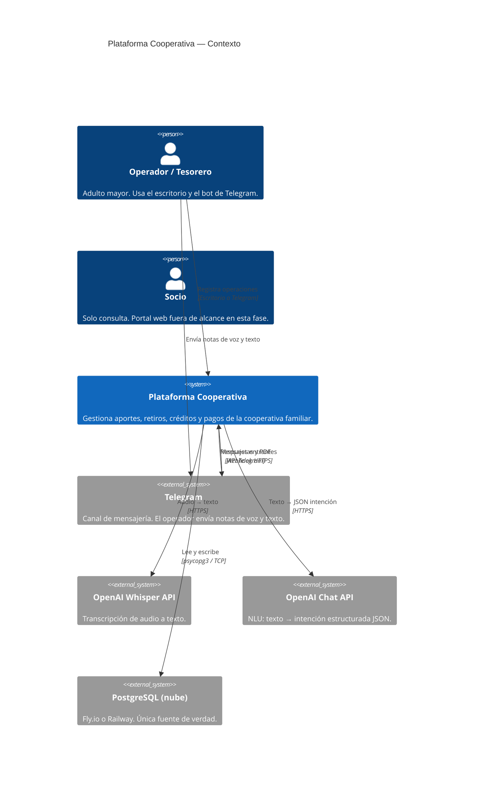
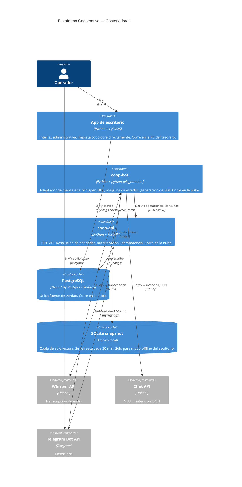
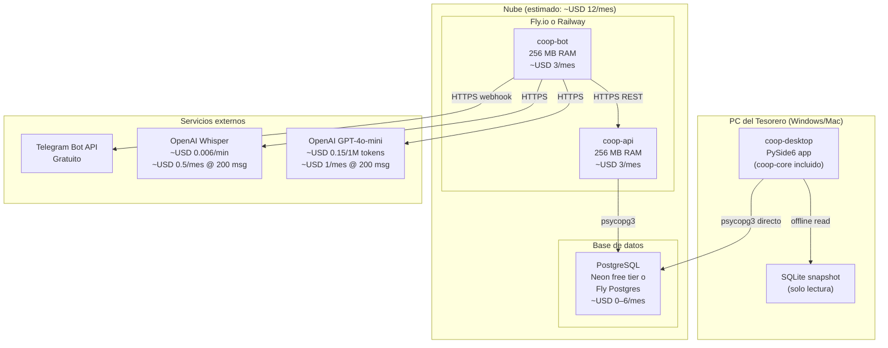

# 02 — Arquitectura

---

## C4 Nivel 1 — Diagrama de contexto



---

## C4 Nivel 2 — Diagrama de contenedores



---

## Diagrama de secuencia — Flujo completo nota de voz

```mermaid
sequenceDiagram
    actor Op as Operador
    participant TG as Telegram
    participant Bot as coop-bot
    participant W as Whisper API
    participant LLM as OpenAI Chat
    participant API as coop-api
    participant DB as PostgreSQL

    Op->>TG: 🎤 "Recibí de Pedro Gómez su aporte\ny el de María por ochenta cada uno"
    TG->>Bot: webhook: audio file_id
    Bot->>TG: getFile → descarga audio
    Bot->>W: transcribeAudio(audio_bytes)
    W-->>Bot: "Recibí de Pedro Gómez su aporte y el de María por ochenta cada uno"

    Note over Bot: Registra en log: audio_url, transcripción

    Bot->>LLM: prompt_sistema + transcripción
    LLM-->>Bot: {"intencion":"registrar_aporte","recibi_de":"Pedro Gómez","aportes":[{"nombre":"Pedro Gómez","monto":80000},{"nombre":"María","monto":80000}]}

    Note over Bot: Registra en log: intención JSON

    Bot->>API: GET /socios?q=Pedro+Gómez
    API-->>Bot: [{id:12, nombre:"Pedro Gómez", score:1.0}]

    Bot->>API: GET /socios?q=María
    API-->>Bot: [{id:7, nombre:"María López", score:0.85}, {id:23, nombre:"María Ruiz", score:0.80}]

    Bot->>TG: "¿Cuál María? (1) María López  (2) María Ruiz"
    Op->>TG: "1"

    Bot->>API: GET /socios/12 (saldo actual)
    Bot->>API: GET /socios/7 (saldo actual)

    Bot->>TG: 📋 Resumen:\nAporte Pedro Gómez: $80.000 (saldo: $320.000 → $400.000)\nAporte María López: $80.000 (saldo: $150.000 → $230.000)\n¿Confirmar? (sí/no)

    Op->>TG: "sí"

    Bot->>API: POST /operaciones/aportes\n  Idempotency-Key: uuid-xyz\n  {recibi_de_id:12, aportes:[...]}
    API->>DB: BEGIN; INSERT recibo; UPDATE socios; COMMIT
    DB-->>API: recibo_id: 47
    API-->>Bot: {recibo_id:47, aportes_registrados:[...]}

    Note over Bot: Registra en log: operacion_id=47

    Bot->>Bot: generar PDF recibo #47
    Bot->>TG: ✅ Recibo #47 registrado\n📄 [PDF adjunto]
    TG->>Op: mensaje + PDF
```

---

## Diagrama de despliegue



**Costo estimado total: USD 7–12/mes** (variable según proveedor de Postgres).

---

## Tabla de límites de confianza

| Frontera | Datos que cruzan | Dirección | Protección |
|----------|-----------------|-----------|------------|
| Operador → Telegram | Audio de voz, texto libre | Saliente del operador | Cifrado de Telegram (E2E opcional) |
| Telegram → coop-bot | audio file_id, texto, chat_id | Entrante al bot | Token del bot en variable de entorno; webhook verificado por Telegram |
| coop-bot → Whisper API | Bytes de audio (puede contener nombres de socios) | Saliente | HTTPS + API key en var de entorno; datos no almacenados por OpenAI (modo transient) |
| coop-bot → OpenAI Chat | Texto transcrito, contexto mínimo del sistema | Saliente | HTTPS + API key; el prompt de sistema no incluye datos de socios más allá de lo transcrito |
| coop-bot → coop-api | JSON de intención + IDs resueltos de socios | Saliente del bot | HTTPS + Bearer token estático; solo desde IP del servidor del bot (firewall si lo permite el proveedor) |
| coop-api → PostgreSQL | Todos los datos financieros | Bidireccional | TLS en tránsito; credenciales en var de entorno; la DB no es accesible públicamente |
| coop-desktop → PostgreSQL | Todos los datos financieros | Bidireccional | TLS en tránsito; credenciales en var de entorno del operador |
| coop-api → coop-bot | Resultados de operaciones, datos de socios para confirmación | Respuesta HTTP | HTTPS |
| coop-bot → Telegram | Mensajes de texto, PDF de comprobante | Saliente | Cifrado de Telegram |

**Dato más sensible en tránsito:** Montos y nombres de socios reales.
**Dato nunca en tránsito hacia Dev B:** Credenciales de Postgres, código de `coop-core`, datos históricos de la DB.
